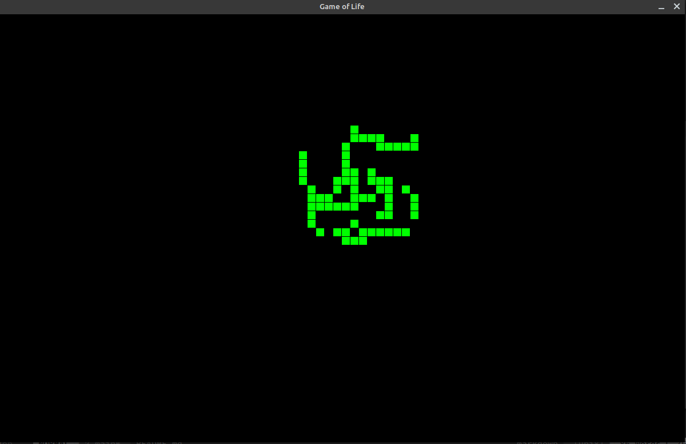
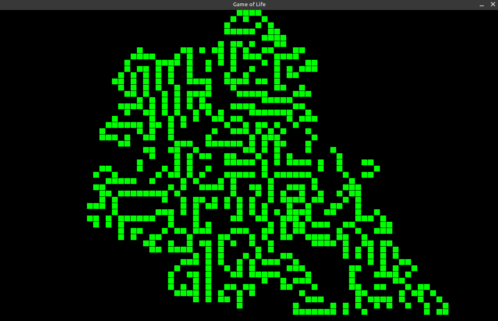
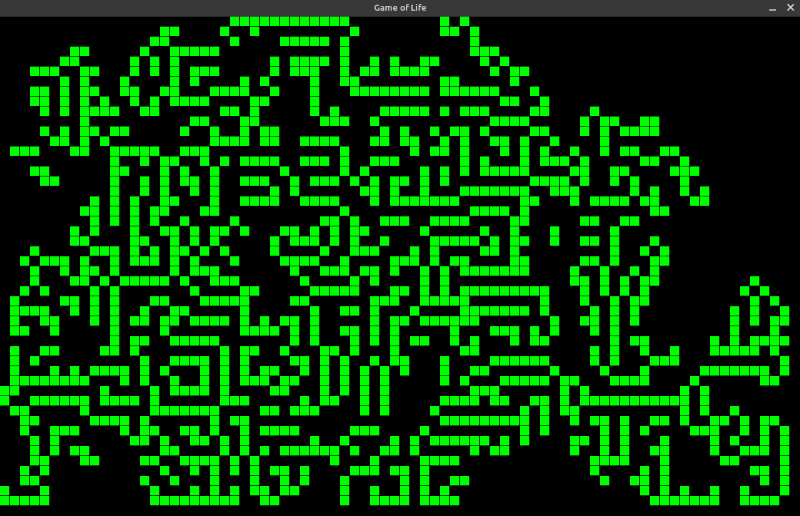

# Conway's Game of Life

this is a simple universe simulation to the game of life problem.
the visualization is done by the PyGame python library

### Usage
 - press down your left mouse key and start drawing the shape you want.
 - press SPACE to start the game.
 - press s key to stop the game.
 - press r key to reset the game

### Requirments
 - pygame
 - python3

### Screenshot

### Other Recources
[Conway Game of Life](https://en.wikipedia.org/wiki/Conway%27s_Game_of_Life)

